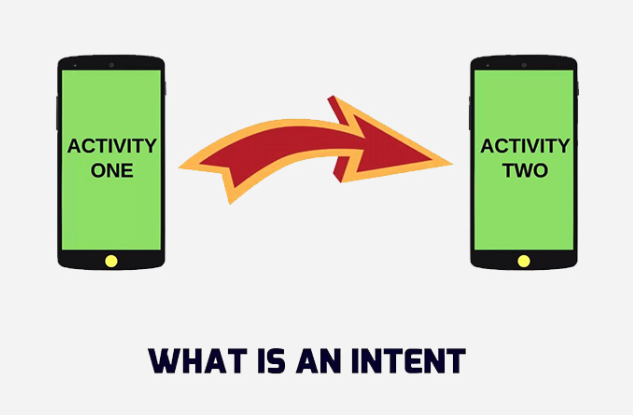
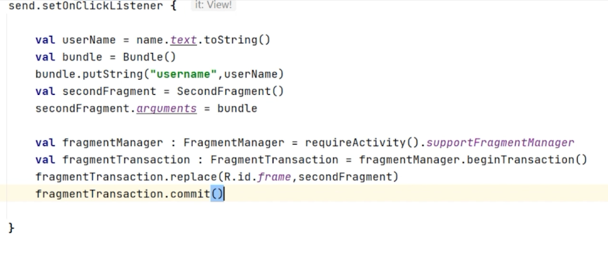

# Navigation Android Kotlin

- Dưới đây là một hướng dẫn chi tiết và đầy đủ với ví dụ thực tế về cách chuyển màn hình trong Android Kotlin theo từng trường hợp sử dụng, với các bước rõ ràng và giải thích cụ thể.



# 1. Chuyển từ Activity sang Activity

- Khi bạn muốn mở một Activity mới

## Ví dụ 1: Chuyển Activity không truyền dữ liệu

- MainActivity.kt:

```kt
val intent = Intent(this, SecondActivity::class.java)
startActivity(intent)

```

- SecondActivity.kt

```kt
class SecondActivity : AppCompatActivity() {
    override fun onCreate(savedInstanceState: Bundle?) {
        super.onCreate(savedInstanceState)
        setContentView(R.layout.activity_second)
    }
}
```

## Ví dụ 2: Chuyển Activity kèm dữ liệu

- MainActivity.kt:

```kt
val intent = Intent(this, SecondActivity::class.java)
intent.putExtra("USERNAME", "John Doe")
intent.putExtra("AGE", 30)
startActivity(intent)
```

- SecondActivity.kt:

```kt
class SecondActivity : AppCompatActivity() {
    override fun onCreate(savedInstanceState: Bundle?) {
        super.onCreate(savedInstanceState)
        setContentView(R.layout.activity_second)

        val userName = intent.getStringExtra("USERNAME")
        val age = intent.getIntExtra("AGE", 0)

        // Hiển thị dữ liệu trong TextView
        findViewById<TextView>(R.id.textView).text = "User: $userName, Age: $age"
    }
}
```

## Ví dụ 3: Nhận kết quả từ Activity (ActivityResult API)

- ActivityResult API được sử dụng khi bạn cần gửi dữ liệu từ một Activity về lại Activity gọi nó (Activity chính).

- Nhận phản hồi từ màn hình khác: Ví dụ, một màn hình cho phép người dùng chọn hình ảnh, điền biểu mẫu, hoặc thay đổi cài đặt và gửi kết quả về.
- Xử lý kết quả từ hoạt động bên ngoài: Ví dụ, mở ứng dụng máy ảnh để chụp ảnh và lấy ảnh về.
- Yêu cầu một lựa chọn: Ví dụ, yêu cầu người dùng chọn tệp hoặc hình ảnh từ thư viện.

### Ví dụ cụ thể: Nhập dữ liệu và trả về kết quả

- MainActivity (Gọi và nhận kết quả)

```kt
//Khai báo ActivityResultLauncher:

class MainActivity : AppCompatActivity() {
    private lateinit var launcher: ActivityResultLauncher<Intent>

    override fun onCreate(savedInstanceState: Bundle?) {
        super.onCreate(savedInstanceState)
        setContentView(R.layout.activity_main)

        val productList = mutableListOf<String>()
        val listView = findViewById<ListView>(R.id.listView)
        val adapter = ArrayAdapter(this, android.R.layout.simple_list_item_1, productList)
        listView.adapter = adapter

        // Đăng ký launcher để nhận kết quả
        launcher = registerForActivityResult(ActivityResultContracts.StartActivityForResult()) { result ->
            if (result.resultCode == Activity.RESULT_OK) {
                val productName = result.data?.getStringExtra("productName")
                if (!productName.isNullOrEmpty()) {
                    productList.add(productName)
                    adapter.notifyDataSetChanged()
                }
            }
        }

        // Khi nhấn nút Add Product
        findViewById<Button>(R.id.addProductButton).setOnClickListener {
            val intent = Intent(this, AddProductActivity::class.java)
            launcher.launch(intent)
        }
    }
}

```

- AddProductActivity (Nhập dữ liệu và gửi trả về)

```xml
<LinearLayout
    xmlns:android="http://schemas.android.com/apk/res/android"
    android:layout_width="match_parent"
    android:layout_height="match_parent"
    android:orientation="vertical"
    android:padding="16dp">

    <EditText
        android:id="@+id/productNameInput"
        android:layout_width="match_parent"
        android:layout_height="wrap_content"
        android:hint="Enter product name" />

    <Button
        android:id="@+id/saveButton"
        android:layout_width="match_parent"
        android:layout_height="wrap_content"
        android:text="Save" />
</LinearLayout>

```

```kt
class AddProductActivity : AppCompatActivity() {
    override fun onCreate(savedInstanceState: Bundle?) {
        super.onCreate(savedInstanceState)
        setContentView(R.layout.activity_add_product)

        val productNameInput = findViewById<EditText>(R.id.productNameInput)
        val saveButton = findViewById<Button>(R.id.saveButton)

        saveButton.setOnClickListener {
            val productName = productNameInput.text.toString()
            if (productName.isNotEmpty()) {
                val resultIntent = Intent()
                resultIntent.putExtra("productName", productName)
                setResult(Activity.RESULT_OK, resultIntent) // Trả kết quả về MainActivity
                finish() // Đóng AddProductActivity
            } else {
                productNameInput.error = "Product name cannot be empty!"
            }
        }
    }
}
```

### Kết quả:

- Khi người dùng nhấn Save trong AddProductActivity, sản phẩm mới sẽ được thêm vào danh sách trong MainActivity.
- ActivityResult API xử lý việc nhận dữ liệu và cập nhật giao diện tự động, giúp mã nguồn ngắn gọn và dễ hiểu hơn.

### Kết hợp với các ActivityResultContracts khác:

```kt
//Chọn ảnh từ thư viện:
val pickImageLauncher = registerForActivityResult(ActivityResultContracts.GetContent()) { uri ->
    imageView.setImageURI(uri)
}

pickImageLauncher.launch("image/*")

//Yêu cầu quyền truy cập:
val requestPermissionLauncher = registerForActivityResult(ActivityResultContracts.RequestPermission()) { isGranted ->
    if (isGranted) {
        // Quyền được cấp
    } else {
        // Quyền bị từ chối
    }
}

requestPermissionLauncher.launch(Manifest.permission.CAMERA)

```

# 2. Chuyển giữa các Fragment



- Fragments được sử dụng trong các ứng dụng có một Activity làm container chính.

## Ví dụ 1: Chuyển Fragment đơn giản

- Activity layout (activity_main.xml):

```xml
<FrameLayout
    android:id="@+id/fragment_container"
    android:layout_width="match_parent"
    android:layout_height="match_parent" />

```

- MainActivity.kt:

```kt
supportFragmentManager.beginTransaction()
    .replace(R.id.fragment_container, FirstFragment())
    .commit()
```

- FirstFragment.kt:

```kt
class FirstFragment : Fragment(R.layout.fragment_first) {
    override fun onViewCreated(view: View, savedInstanceState: Bundle?) {
        super.onViewCreated(view, savedInstanceState)

        view.findViewById<Button>(R.id.buttonNavigate).setOnClickListener {
            parentFragmentManager.beginTransaction()
                .replace(R.id.fragment_container, SecondFragment())
                .addToBackStack(null)
                .commit()
        }
    }
}

```

## Ví dụ 2: Truyền dữ liệu giữa các Fragment

- Gửi dữ liệu qua Bundle từ FirstFragment:

```kt
val bundle = Bundle()
bundle.putString("USERNAME", "John Doe")
val secondFragment = SecondFragment()
secondFragment.arguments = bundle

parentFragmentManager.beginTransaction()
    .replace(R.id.fragment_container, secondFragment)
    .addToBackStack(null)
    .commit()

```

- Nhận dữ liệu trong SecondFragment:

```kt
val userName = arguments?.getString("USERNAME")
view.findViewById<TextView>(R.id.textView).text = "Hello, $userName"

```
